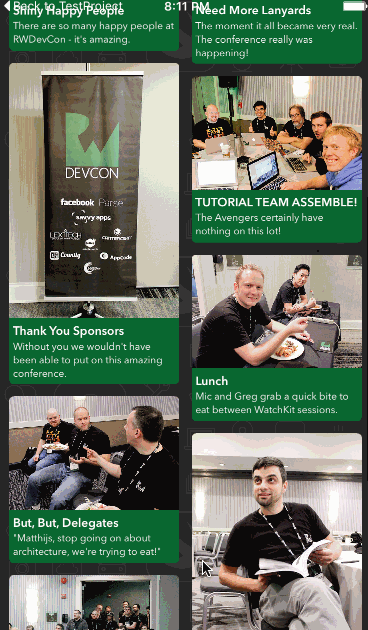

# Pinterest
[raywenderlich教程](https://www.raywenderlich.com/107439/uicollectionview-custom-layout-tutorial-pinrt)
自定义CollectionView layout 布局

##实现
先新建一个继承于UICollectionViewLayout的类PinterestLayout，`不是继承UICollectionViewFlowLayout`，其实这只不过是苹果提供的一个自定义布局而已。

需要重写3个函数

+ prepareLayout()　　// 计算将要布局的各个cell的attributes(frame，center....)
+ collectionViewContentSize()->CGSize	// 最终整个CollectionView的contentSize就是scrollView的contentSize
+ layoutAttributesForElementsInRect(rect)->[UICollectionViewLayoutAttributes]? // 在当前显示的rect下的cell的attributes，只需要加入当前显示视图内的cell即可, 该方法会在prepareLayout之后被调用

###PinterestLayoutDelegate
我们需要delegate来得到图片的高度，文字的高度

```
protocol PinterestLayoutDelegate {
  // 1
  func collectionView(collectionView:UICollectionView, heightForPhotoAtIndexPath indexPath:NSIndexPath,
                      withWidth width:CGFloat) -> CGFloat
  // 2
  func collectionView(collectionView: UICollectionView,
                      heightForAnnotationAtIndexPath indexPath: NSIndexPath, withWidth width: CGFloat) -> CGFloat
}
```
###成员变量
delegate是必需品，

```
// 1
  var delegate: PinterestLayoutDelegate!
  
  // 2
  var numberOfColumns = 2 // 列数量
  var cellPadding: CGFloat = 6.0 // cell之间的间距
  
  // 3
  private var cache = [PinterestLayoutAttributes]()
  
  // 4
  private var contentHeight: CGFloat = 0.0 // 统计整个contentsize的高度
  private var contentWidth: CGFloat {
    let insets = collectionView!.contentInset
    return CGRectGetWidth(collectionView!.bounds) - (insets.left + insets.right)
  }

```
###PrepareLayout()
计算每个cell的属性，主要计算frame

```
override func prepareLayout() {
    guard cache.isEmpty else {
      // 已经计算过了，不需要重复计算，此demo只针对已知cell个数，如果使用insert等可以重载invalidateLayout()等函数
      return
    }
    // 一行的宽度
    let columnWidth = contentWidth / CGFloat(numberOfColumns) 
    // 每行的origin.x
    var xOffset = [CGFloat]()	
    for column in 0 ..< numberOfColumns {
      xOffset.append(CGFloat(column) * columnWidth)
    }
    
    var column = 0
    // 存储每列的累积高度
    var yOffset = [CGFloat](count: numberOfColumns, repeatedValue: 0)
    
    for item in 0 ..< collectionView!.numberOfItemsInSection(0) {
      // 计算每个cell
      let indexPath = NSIndexPath(forItem: item, inSection: 0)
      let width     = columnWidth - cellPadding * 2
      
      // 通过delegate获取cell图片的高度和文字的高度
      let phototHeight     = delegate.collectionView(collectionView!, heightForPhotoAtIndexPath: indexPath, withWidth: width)
      let annotationHeight = delegate.collectionView(collectionView!, heightForAnnotationAtIndexPath: indexPath, withWidth: width)
      let height           = phototHeight + annotationHeight + cellPadding * 2
      let frame            = CGRect(x: xOffset[column], y: yOffset[column], width: columnWidth, height: height)
      // 最终cell.frame
      let insetFrame       = CGRectInset(frame, cellPadding, cellPadding)
      
      let attributes = UICollectionViewLayoutAttributes(forCellWithIndexPath: indexPath)
      attributes.frame = insetFrame
      cache.append(attributes) // 缓存cell的属性

      // 累积contentSize的高度
      contentHeight = max(contentHeight, CGRectGetMaxY(frame)) 
      yOffset[column] += height
      
      column = (column + numberOfColumns + 1) % numberOfColumns
    }
  }
```

###collectionViewContentSize() -> CGSize
这个很直接，看字面意思就可以理解了

```
override func collectionViewContentSize() -> CGSize {
    return CGSize(width: contentWidth, height: contentHeight)
  }
```
###layoutAttributesForElementsInRect(rect) -> [UICollectionViewLayoutAttributes]?

```
// called after prepareLayout()
  // the attributes of cells in the visible view's rect
  override func layoutAttributesForElementsInRect(rect: CGRect) -> [UICollectionViewLayoutAttributes]? {
    var layoutAttributes = [UICollectionViewLayoutAttributes]()
    for attributes in cache {
      if CGRectIntersectsRect(attributes.frame, rect) {
        // 计算cell是否在在显示视图的rect内
        layoutAttributes.append(attributes)
      }
    }
    
    return layoutAttributes
  }
```

## 可以运行一下代码，样子已经出来了
但是我们发现图片的大小并没有变化成功
###处理
创建一个PinterestLayoutAttributes，继承于UICollectionViewLayoutAttributes

```

class PinterestLayoutAttributes: UICollectionViewLayoutAttributes {
  var photoHeight : CGFloat = 0.0
  
  override func copyWithZone(zone: NSZone) -> AnyObject {
    let copy = super.copyWithZone(zone) as! PinterestLayoutAttributes
    copy.photoHeight = photoHeight
    return copy
  }
  
  override func isEqual(object: AnyObject?) -> Bool {
    if let attributes = object as? PinterestLayoutAttributes {
      if attributes.photoHeight == photoHeight {
        return super.isEqual(object)
      }
    }
    
    return false
  }
}
```
记录下每个图片的高度，修改一下prepareLayout中的代码，将attributes变成PinterestLayoutAttributes，并记录下图片高度
####AnnotatedPhotoCell
在cell将响应attriibutes的时候将图片的高度约束设定好

```
override func applyLayoutAttributes(layoutAttributes: UICollectionViewLayoutAttributes) {
    super.applyLayoutAttributes(layoutAttributes)
    if let attributes = layoutAttributes as? PinterestLayoutAttributes {
      imageViewHeightLayoutConstraint.constant = attributes.photoHeight
    }
  }
```

#THE END